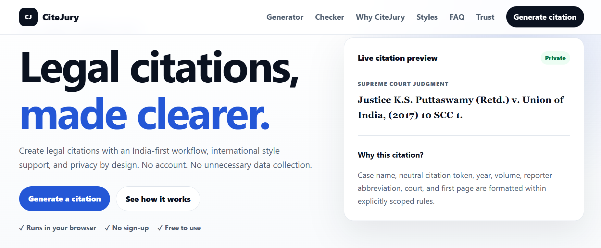

# CiteJury

**Privacy-first legal citation tools with an India-first workflow.**

[](https://citejury.citejury.workers.dev/)



## About

CiteJury is a free, browser-based legal citation toolkit for students, researchers, advocates, and legal professionals.

The site runs entirely in the browser. No account is required, and citation input is not sent to a backend.

## Live website

**https://citejury.citejury.workers.dev/**

## Core tools

- **Citation Generator** — create structured legal citation drafts.
- **Citation Checker** — review SCC, AIR, and Supreme Court of India neutral citation structures.
- **Citation Doctor** — understand detected components, possible issues, and when manual verification is required.

## Supported workflows

CiteJury provides scoped support for:

- SCC-style judgments
- AIR-style judgments
- Supreme Court of India neutral citations (`INSC`)
- Indian legal judgment drafts
- Constitution of India references
- Legislation
- OSCOLA cases, books, and journals
- Website references

CiteJury checks structure and plausibility. It does not verify whether a case, reporter entry, page number, or neutral citation exists in an official database.

## Trust and validation

The frozen citation core was tested for:

- Valid and invalid SCC, AIR, and INSC structures
- Future and impossible numeric values
- Invalid AIR court tokens
- Generator-to-Checker consistency
- Citation Doctor suggestion safety
- Cross-format state isolation
- Repeated-use and mobile stability

A safe warning or rejection is preferred over a confident but unreliable result.

## Privacy

- No sign-up
- No backend
- No database
- No citation input submission
- No active analytics
- No active advertisements

All core processing happens locally in the browser.

## Architecture

- HTML
- CSS
- Vanilla JavaScript
- Static JSON configuration
- Cloudflare Workers Static Assets
- No required build step
- No runtime server dependency

## Project status

**Stable and trust-frozen.**

The Generator, Checker, Citation Doctor, and validation rules should only be changed to correct a confirmed user-facing defect.

The site is currently free and advertisement-free. Monetization may be reconsidered later if organic traffic justifies a custom domain.

## Repository structure

```text
assets/      Styles, scripts, images, and configuration
docs/        Architecture, release, trust, and operational documentation
guides/      Public legal citation guides
tests/       Browser-based verification pages
index.html   Main application
```

## Running locally

No installation or build step is required.

Open `index.html` directly, or serve the directory with any static file server:

```bash
python -m http.server 8000
```

Then open `http://localhost:8000`.

## Disclaimer

CiteJury is an educational and drafting aid. It does not provide legal advice and does not replace verification against official court, reporter, institutional, or style-guide sources.

## License

Add the repository's chosen license before accepting external contributions or reuse.
